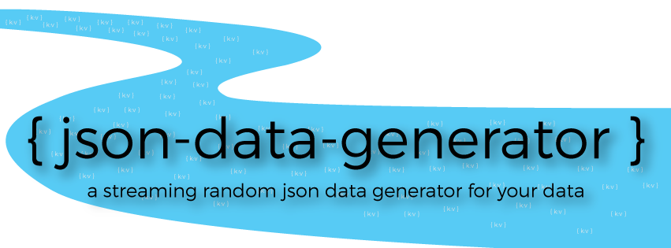

## Json Data Generator

<div style="text-align:center"></div>

Have you ever needed to generate a realtime stream of json data in order to test an application? When thinking about a good source of streaming data, we often look to the Twitter stream as a solution, but that only gets us so far in prototyping scenarios and we often fall short because Twitter data only fits a certain amount of use cases. There are plenty of json data generator online (like [json-generator](http://www.json-generator.com/), or [mockaroo](https://www.mockaroo.com/)), but we couldn't find an offline data generator for us to use in our testing and protyping, so we decided to build one.  We found it so useful, that we decided to open source it as well so other can make use of it in their own projects.  

For more infomation, check out the [announcement blog post](http://acesinc.net/introducing-a-streaming-json-data-generator/). 

### Features
We had a couple of needs when it came to generating data for testing purposes. They were as follows:

* **Generate json documents that are defined in json themselves**. This would allow us to take existing schemas, drop them in to the generator, modify them a bit and start generating data that looks like what we expect in our application
* **Generate json with random data as values**. This includes differnt types of random data, not just random characters, but things like random names, counters, dates, primitave types, etc.
* **Generate a constant stream of json events that are sent somewhere**. We might need to send the data to a log file or to a Kafka topic or something else.  
* **Generate events in a defined order, at defined or random time periods** in order to act like a real system. 

We now have a data generator that supports all of these things that can be run on our own networks and produce streams of json data for applications to consume.  

### Architecture
The Generator has the following basic architecture:

* `JsonDataGenerator` - The main application that loads configurations and runs simulations. 
* `Simulation Configuration` - A json file that represents your over all simulation you would like to run. 
* `Workflow Definitions` - Json files that define a workflow that is run by your Simulation.  

When you start the `JsonDataGenerator`, you specify your `Simulation Configuration` which also references one or many `Workflow Definitions.`  The Simulation is loaded and the Workflows are created within the application and each workflow is started within it's own thread. Json events are generated and sent on to the defined `Producers`.  

#### What's defined Where
There are multiple pieces of information that you as a developer/integrator need to define within your configuration files. We'll break down what goes where in this section. 

##### Simulation Configuration
The `Simulation Configuration` defines the following:

| Property        | Type           | Description   |
| --------------- |----------------| --------------|
| workflows | Array | Defines a list of workflows to run |
| producers | Array | Defines a list of producers that events should be sent to |

A `Workflow` is defined with the following properties:

| Property        | Type           | Description   |
| --------------- |----------------| --------------|
| workflowName | String | A name for the workflow |
| workflowFilename | String | The filename of the workflow config file to run |

Here is an example of a Workflow configuration:

```
"workflows": [{
            "workflowName": "test",
            "workflowFilename": "exampleWorkflow.json"
        }]
```

A `Producer` is defined with the following properties:

| Property        | Type           | Description   |
| --------------- |----------------| --------------|
| type | String | The type of the producer |
| optional properties | String | Other properties are added to the producer config based on the `type` of Producer |

Currenty supported `Producers` and their configuration properties are:

**Logger**
A Logger Producer sends json events to a log file in the `logs` directory into a file called json-data.log. The logs roll based on time and size. Configure it like so:

```
{
    "type": "logger"
}
```
No configuration options exist for the Logger Producer at this time. 

**Kafka**
A Kafka Producer sends json events to the specified Kafka broker and topic as a String. Configure it like so:

```
{
    "type": "kafka",
    "broker.server": "192.168.59.103",
    "broker.port": 9092,
    "topic": "logevent",
    "flatten": false,
    "sync": false
}
```
If `sync=false`, all events are sent asynchronously. If for some reason you would like to send events synchronously, set `sync=true`. If `flatten=true`, the Producer will flatten the json before sending it to the Kafka queue, meaning instead of having nested json objects, you will have all properties at the top level using dot notation like so:

```
{
    "test": {
    	"one": "one",
    	"two": "two"
   	},
   	"array": [
   		{
   			"element1": "one"
   		},{
   			"element2": "two"
   		}]
}
```

Would become

```
{
	"test.one": "one",
	"test.two": "two",
	"array[0].element1": "one",
	"array[1].element2": "two"
}
```

**Tranquility**
A Tranquility Producer sends json events using [Tranquility](https://github.com/metamx/tranquility) to a [Druid](http://druid.io) cluster. Druid is an Open Source Analytics data store and Tranquility is a realtime communication transport that druid supports for ingesting data.  Configure it like so:

```
{
    "type": "tranquility",
    "zookeeper.host": "localhost",
    "zookeeper.port": 2181,
    "overlord.name":"overlord",
    "firehose.pattern":"druid:firehose:%s",
    "discovery.path":"/druid/discovery",
    "datasource.name":"test",
    "timestamp.name":"startTime",
    "sync": true,
    "geo.dimensions": "where.latitude,where.longitude"  
}
```
When sending data to Druid via Tranquility, we are sending a Task to the Druid Overlord node that will perform realtime ingestion. Our task implementation currently does not allow users to specifc the aggregators that are used. We create a single "events" metric that is a Count Aggregation. Everything else if configured though the properties. The `sync` and `flatten` properties behave exactly the same ast the Kafka Producer.  This works for us currently, but if you need more capability, please file an issue or submit a pull request!  

When you start the Generator, it will contact the Druid Overlord and craete a task for your datasource and will then begin streaming data into Druid.  

**Full Simulation Config Example**

Here is a full example of a `Simulation Configuration` file:

```
exampleSimConfig.json:
{
    "workflows": [{
            "workflowName": "test",
            "workflowFilename": "exampleWorkflow.json"
        }],
    "producers": [{
            "type": "kafka",
            "broker.server": "192.168.59.103",
            "broker.port": 9092,
            "topic": "logevent",
            "sync": false
    },{
        "type":"logger"
    }]
}
```
This simulation will run a single `Workflow` and send all the events to both the defined Kafka topic and to the Logger producer that put the events in to a log file.  

##### Workflow Definition
The `Workflow` is defined in seperate files to allow you to have and run multiple `Workflows` within your Simulation.  A Workflow contains the following properties:

| Property        | Type           | Description   |
| --------------- |----------------| --------------|
| eventFrequency | integer | The time in milliseconds events between steps should be output at |
| varyEventFrequency | boolean | If true, a random amount (between 0 and half the eventFrequency) of time will be added/subtracted to the eventFrequency |
| repeatWorkflow | boolean | If true, the workflow will repeat after it finishes |
| timeBetweenRepeat | integer | The time in milliseconds to wait before the Workflow is restarted |  
| varyRepeatFrequency | boolean | If true, a random amount (between 0 and half the eventFrequency) of time will be added/subtracted to the timeBewteenRepeat  |  
| steps | Array | A list of Workflow Steps to be run in this Workflow |

**Workflow Steps**

Workflow Steps are meat of your generated json events. They specify what your json will look like and how they will be generated. They are defined like so:

**Step**

| Property        | Type           | Description   |
| --------------- |----------------| --------------|
| config | array of objects | The json objects to be generated during this step |
| duration | integer | If 0, this step will run once. If -1, this step will run forever. Any of number is the time in milliseconds to run this step for. |

**Step Config**

The configuration specified in the step `config` section is the actual json you want output.  For example, you could put the following json as the config for a step in your workflow:

```
{
    "test": "this is a test",
    "test2": "this is another test",
    "still-a-test": true
}
```
Specifying this as the step config would literly generate that json object every time the step ran. Now, that's interesting, but just echoing json isn't really what we are after.  Our Generator support a number of `Functions` that can be placed into your json as the value. These `Functions` will be run everytime the json is generated.  Here is an example:

```
{
    "timestamp": "nowTimestamp()",
    "system": "random('BADGE', 'AUDIT', 'WEB')",
    "actor": "bob",
    "action": "random('ENTER','LOGIN','EXIT', 'LOGOUT')",
    "objects": ["Building 1"],
    "location": {
    	"lat": "double(-90.0, 90.0)",
    	"lon": "double(-180.0, 180.0)"
    },
    "message": "Entered Building 1"
}
```
This config will generate json documents that look something like:

```
{"timestamp":1430244584899,"system":"BADGE","actor":"bob","action":"LOGOUT","objects":["Building 1"],"location":{"lat":-19.4224,"lon":-165.0512},"message":"Entered Building 1"}
```
Each time, the timestamp, system, action, and lat/lon values would be randomly generated.  

**Full Workflow Definition Config Example**

Here is a full example of a `Workflow Definition` file:

```
exampleWorkflow.json:
{
    "eventFrequency": 4000,
    "varyEventFrequency": true,
    "repeatWorkflow": true,
    "timeBetweenRepeat": 15000,
    "varyRepeatFrequency": true,
    "steps": [{
        "config": [{
    		"timestamp": "nowTimestamp()",
		    "system": "random('BADGE', 'AUDIT', 'WEB')",
		    "actor": "bob",
		    "action": "random('ENTER','LOGIN','EXIT', 'LOGOUT')",
		    "objects": ["Building 1"],
		    "location": {
		    	"lat": "double(-90.0, 90.0)",
		    	"lon": "double(-180.0, 180.0)"
		    },
		    "message": "Entered Building 1"
		}],
        "duration": 0
    },{
        "config": [{
    		"timestamp": "nowTimestamp()",
		    "system": "random('BADGE', 'AUDIT', 'WEB')",
		    "actor": "jeff",
		    "action": "random('ENTER','LOGIN','EXIT', 'LOGOUT')",
		    "objects": ["Building 2"],
		    "location": {
		    	"lat": "double(-90.0, 90.0)",
		    	"lon": "double(-180.0, 180.0)"
		    },
		    "message": "Entered Building 2"
		}],
        "duration": 0
    }]
}
```
This workflow would output the defined json about every 4 seconds and then it will wait about 15 seconds before starting again.  

## Running The Generator
Now that you know how to configure the Generator, it's time to run it.  You will need maven to build the application until we put a release up to download. 

First, clone/fork the repo:

```
git clone git@github.com:acesinc/json-data-generator.git
cd json-data-generator
```
Now build it!
```
mvn clean package
```
Once this completes, a tar file will have been generated for you to use.  Unpack the tar file somewhere you want to run the application from:

```
cp target/json-data-generator-1.0.0-bin.tar your/directory
cd your/directory
tar xvf json-data-generator-1.0.0-bin.tar
cd json-data-generator
```
In the `conf` directory, you will find an example `Simulation Configuration` and an example `Workflow Definition`.  You can change these or make your own configurations to run with, but for now, we will just run the examples.  This example simulates an auditing system that generates events when a user performs an action on a system.  To do so, do the following: 

```
java -jar json-data-generator-1.0.0.jar exampleSimConfig.json
```
You will start seeing output in your console and data will begin to be generated.  It will look something like this:

```
...
2015-04-28 14:21:08,013 DEBUG n.a.d.j.g.t.TypeHandlerFactory [Thread-2] Discovered TypeHandler [ integer,net.acesinc.data.json.generator.types.IntegerType ]
2015-04-28 14:21:08,013 DEBUG n.a.d.j.g.t.TypeHandlerFactory [Thread-2] Discovered TypeHandler [ timestamp,net.acesinc.data.json.generator.types.TimestampType ]
2015-04-28 14:30:02,817 INFO data-logger [Thread-2] {"timestamp":1430253002793,"system":"BADGE","actor":"bob","action":"ENTER","objects":["Building 1"],"location":"45.5,44.3","message":"Entered Building 1"}
2015-04-28 14:30:05,369 INFO data-logger [Thread-2] {"timestamp":1430253005368,"system":"AD","actor":"bob","action":"LOGIN","objects":["workstation1"],"location":null,"message":"Logged in to workstation 1"}
2015-04-28 14:30:07,491 INFO data-logger [Thread-2] {"timestamp":1430253007481,"system":"AUDIT","actor":"bob","action":"COPY","objects":["/data/file1.txt","/share/mystuff/file2.txt"],"location":null,"message":"Printed /data/file1.txt"}
2015-04-28 14:30:09,768 INFO data-logger [Thread-2] {"timestamp":1430253009767,"system":"AUDIT","actor":"bob","action":"COPY","objects":["/data/file1.txt","/share/mystuff/file2.txt"],"location":null,"message":"Printed /data/file1.txt"}
```

This example only outputs to the `Logger` Producer, so all the data is going to your console and it is also being written to `json-data-generator/logs/json-data.log`. The data written to json-data.log is a single event per line and does not contain the logging timestamps and other info like above.  

If you were to create your own simulation config called `mySimConfig.json`, you would place that file and any workflow conigs into the `conf` directory and run the application again like so:

```
java -jar json-data-generator-1.0.0.jar mySimConfig.json
```

## Supported Functions
As you saw in the `Workflow Definition`, our Generator supports a number of different functions that allow you to generate random data for the values in your json documents.  Below is a list of all the currently supported `Functions` and the arguments they support/require.

### Literals
If you specify a literal value as the value of a property, it will just be echoed back into the generated json. For example:

```
{
	"literal-bool": true
}
```
Will always generate:

```
{ 
    "literal-bool": true 
}
```

### String Functions
| Function        | Arguments           | Description   |
| --------------- |----------------| --------------|
| `alpha(#)` | The number of characters to generate | Generates a random string of Alphabetic charaters with the length specified|
| `alphaNumeric(#)` | The number of characters to generate | Generates a random string of AlphaNumeric charaters with the length specified |
| `firstName()` | n/a | Generates a random first names from a predefined list of names |
| `lastName()` | n/a | Generates a random last names from a predefined list of names |
| `uuid()` | n/a | Generates a random UUID |


### Primitave Functions
| Function        | Arguments           | Description   |
| --------------- |----------------| --------------|
| `boolean()` | n/a | Random true/false |
| `double([min, max])` | Optional min val or range | If no args, generates a random double between Double.MIN & MAX. If one arg, generates a double between that min and Double.MAX. If two args, generates a double between those two numbers. |
| `integer([min, max])` | Optional min val or range | If no args, generates a random integer between Integer.MIN & MAX. If one arg, generates a double between that min and Integer.MAX. If two args, generates a double between those two numbers. |
| `long([min, max])` | Optional min val or range | If no args, generates a random long between Long.MIN & MAX. If one arg, generates a double between that min and Long.MAX. If two args, generates a double between those two numbers. |


### Date Functions

| Function        | Arguments           | Description   |
| --------------- |----------------| --------------|
| `date([yyyy/MM/dd,yyyy/MM/dd])` | Optional min date or date range | Generates a random date between the min and max specified.  If no args, generates a random date before today. If one arg, generates a date after the specified min.  If two args, generates a date between those dates. |
| `now([#_unit])`| Optional number and unit to add to the now date | If no args, generates the date of now. If one arg, it will use the # portion as the amount of time and the unit portion (y=year,d=day,h=hour,m=minute) to convert the # to the time to add.  If you want to subtract time, make your number negative (i.e. -5_d). Generates date in iso8601 formatted string |
| `timestamp([yyyy/MM/dd,yyyy/MM/dd])` | Optional min date or date range | Generates a timestamp (i.e. long value) of the specified range. Same rules as the date() Function apply |
| `nowTimestamp()` | n/a | Generates a timestamp (i.e. long value) of the now date. |


### Special Functions

| Function        | Arguments           | Description   |
| --------------- |----------------| --------------|
| `random(val1,val2,...)` | Literal values to choose from. Can be Strings, Integers, Longs, Doubles, or Booleans | Randomly chooses from the specified values |
| `counter(name)` | The name of the counter to generate | Generates a one up number for a specific name. Specify different names for differnt counters. |
| `this.propName` | propName = the name of another property | Allows you to reference other values that have already been generated (i.e. they must come before).  For example, this.test.nested-test will reference the value of test.nested-test in the previously generated json object. You can also specify a `this.` clause when calling other functions like `date(this.otherDate)` will generate a date after another generated date. |
| `cur.propName` | propName = the name of another property at the same level as this property | Allows you to reference other values at the same level as the current property being generated. This is useful when you want to reference properties within a generated array and you don't know the index of the arrary. |

#### Arrays
We have two super special `Functions` for use with arrays. They are `repeat()` and `random()`.  The `repeat()` function is used to specify that you want the Generator to take the elements in the array, and repeat its generator a certain number of times.  You can specify the number of times or if you provide no arguments, it will repeat it 0-10 times.  Use it like so:

```
{
    "values": [
        "repeat(7)",
        {
        	"date": "date('2015/04/01', '2015/04/25')",
        	"count": "integer(1, 10)"
        }]
}
```
This will generate a json object that has 7 values each with different random values for `date` and `count`. 

The `random()` function will tell the generator to pick a random element from the array and out put that element only. Use it like so:
```
```
{
    "values": [
        "random()",
        {
        	"date": "date('2015/04/01', '2015/04/25')",
        	"count": "integer(1, 10)"
        },{
        	"thing1": "random('red', 'blue')"
        }]
}
```

This will generate an array with one element that is either the element with `date` & `count` or the element with `thing1` in it. 

## Examples
Here is a Kitchen Sink example to show you all the differnt ways you can generate data:

```
{
    "strings": {
        "firstName": "firstName()",
        "lastName": "lastName()",
        "random": "random('one', \"two\", 'three')",
        "alpha": "alpha(5)",
        "alphaNumeric": "alphaNumeric(10)",
        "uuid": "uuid()"
    },
    "primatives": {
        "active": "boolean()",
        "rand-long": "long()",
        "rand-long-min": "long(895043890865)",
        "rand-long-range": "long(787658, 8948555)",
        "rand-int": "integer()",
        "rand-int-min": "integer(80000)",
        "rand-int-range": "integer(10, 20)",
        "rand-double": "double()",
        "rand-double-min": "double(80000.44)",
        "rand-double-range": "double(10.5, 20.3)"
    },
    "dates": {
        "rand-date": "date()",
        "min-date": "date(\"2015/03/01\")",
        "range-date": "date(\"2015/03/01\",\"2015/03/30\")",
        "now": "now()",
        "nowTimestamp": "nowTimestamp()",
        "5days-ago": "now(-5_d)",
        "timestamp": "timestamp(\"2015/03/01\",\"2015/03/30\")"
    },
    "literals": {
        "literal-bool": true,
        "literal-int": 34,
        "literal-long": 897789789574389,
        "literal-double": 45.33
    },
    "references": {
        "after-5days-ago": "date(this.dates.5days-ago)",
        "isItActive": "this.primatives.active"
    },
    "counters": {
        "counter1": "counter('one')",
        "counter2": "counter('two')",
        "counter2-inc": "counter('two')"
    },
    "array": [
        {
            "thing": "alpha(3)"
        },
        {
            "thing2": "alpha(3)"
        },
        {
            "thing3": true
        },
        {
            "thing4": "job"
        }
    ],
    "repeat-array": [
        "repeat(3)",
        {
            "thing1": "random('red','blue')",
            "thing2": "random('red', 'blue')"
        }
    ]
}
```
Which generates the following json:

```
{
    "strings": {
        "firstName": "Bob",
        "lastName": "Black",
        "random": "two",
        "alpha": "ihDra",
        "alphaNumeric": "F4mmpuSRDI",
        "uuid": "1f04040f-fc6c-4de0-a17f-c588d1b62e75"
    },
    "primatives": {
        "active": false,
        "rand-long": 8886422858603719071,
        "rand-long-min": 4635399365989710039,
        "rand-long-range": 6934933,
        "rand-int": 433941228,
        "rand-int-min": 519082863,
        "rand-int-range": 17,
        "rand-double": 7.339790593356424E307,
        "rand-double-min": 1.7261947151579352E308,
        "rand-double-range": 11.0806
    },
    "dates": {
        "rand-date": "1996-07-18T13:50Z",
        "min-date": "2015-03-09T13:50Z",
        "range-date": "2015-03-07T13:50Z",
        "now": "2015-04-28T13:50Z",
        "nowTimestamp": 1430250600027,
        "5days-ago": "2015-04-23T13:50Z",
        "timestamp": 1425588600027
    },
    "literals": {
        "literal-bool": true,
        "literal-int": 34,
        "literal-long": 897789789574389,
        "literal-double": 45.33
    },
    "references": {
        "after-5days-ago": "2015-04-24T13:50Z",
        "isItActive": false
    },
    "counters": {
        "counter1": 0,
        "counter2": 0,
        "counter2-inc": 1
    },
    "array": [{
            "thing": "Psu"
        }, {
            "thing2": "yoU"
        }, {
            "thing3": true
        }, {
            "thing4": "job"
        }],
    "repeat-array": [{
            "thing1": "red",
            "thing2": "blue"
        }, {
            "thing1": "blue",
            "thing2": "blue"
        }, {
            "thing1": "blue",
            "thing2": "red"
        }]
}
```
